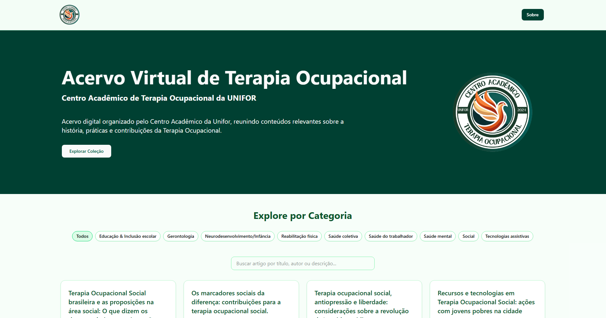

[TYPESCRIPT]: https://img.shields.io/badge/typescript-%23007ACC.svg?style=for-the-badge&logo=typescript&logoColor=white
[NEXT]: https://img.shields.io/badge/Next-black?style=for-the-badge&logo=next.js&logoColor=white
[NODE]: https://img.shields.io/badge/node.js-6DA55F?style=for-the-badge&logo=node.js&logoColor=white
[TAILWINDCSS]: https://img.shields.io/badge/tailwindcss-%2338B2AC.svg?style=for-the-badge&logo=tailwind-css&logoColor=white
[PROJECT__BADGE]: https://img.shields.io/badge/📱Visit_this_project-000?style=for-the-badge&logo=project
[PROJECT__URL]: https://acervovirtualdetodocato.vercel.app/

<h1 align="center" style="font-weight: bold;">Acervo Virtual de Terapia Ocupacional 📚</h1>

![NodeJS][NODE]
![Next JS][NEXT]
![TypeScript][TYPESCRIPT]
![TailwindCSS][TAILWINDCSS]

  <a href="#about">About</a>

    

<h2 id="started">📌 About</h2>

📚 Acervo Virtual de Terapia Ocupacional — UNIFOR  
Este projeto é uma plataforma web desenvolvida para o Centro Acadêmico de Terapia Ocupacional da Universidade de Fortaleza (UNIFOR), com o objetivo de reunir, organizar e disponibilizar um acervo digital de artigos científicos produzidos ou indicados por estudantes e docentes da graduação.

✨ Funcionalidades principais:

- Cadastro de novos artigos científicos pelos alunos.
- Visualização pública dos artigos.
- Filtros por categoria e busca por palavras-chave.
- Interface intuitiva e responsiva.
- Organização de conteúdos por temas e áreas da Terapia Ocupacional.

🎯 Objetivo  
O objetivo central é promover a autonomia estudantil e facilitar o acesso ao conhecimento científico dentro do curso de Terapia Ocupacional. Ao centralizar conteúdos importantes em uma única plataforma, o sistema contribui para a valorização da produção acadêmica local e para a troca de saberes entre os alunos.

[![project][PROJECT__BADGE]][PROJECT__URL]
